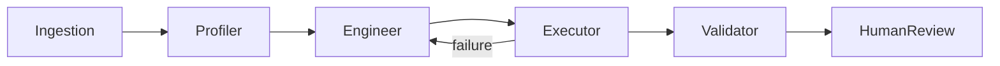

# Content Creator — Agentic ETL Platform

Learning-first agentic ETL pipeline: ingest Instagram export data, run a multi-agent LangGraph workflow (Profiler → Engineer → Executor → Validator), and produce a gold-layer taste profile in PostgreSQL.

## Quick start

```bash
cp .env.example .env
docker compose up --build
```

Services:

| Service | URL |
|---------|-----|
| API | http://localhost:8000/docs |
| Streamlit UI | http://localhost:8501 |
| Postgres | localhost:5432 |

## Phase 0 lab (no Docker required)

```bash
cd backend
python -m venv .venv && source .venv/bin/activate
pip install -e .
# Start Postgres locally or use docker compose up postgres redis -d
export DATABASE_URL=postgresql+psycopg://cc:cc@localhost:5432/content_creator
python lab/minimal_etl_lab.py
```

## Upload data

1. **Sample JSON:** `backend/sample_data/liked_posts_sample.json`
2. **Instagram export:** Accounts Center → Export your information → upload the ZIP via Streamlit or `POST /ingest/export`

## Agent pipeline



Enable **Simulate silver failure** to see the Engineer ↔ Executor self-healing loop.

## Cloud SQL migration

Use the same `DATABASE_URL` with a Cloud SQL Postgres connection string. Move `STORAGE_PATH` to GCS/S3 for bronze artifacts. No SQLite — schema is Alembic-ready.

## Phase 2 (not implemented yet)

- Instagram Graph API OAuth sync
- Trend Scout + Content Strategist agents
